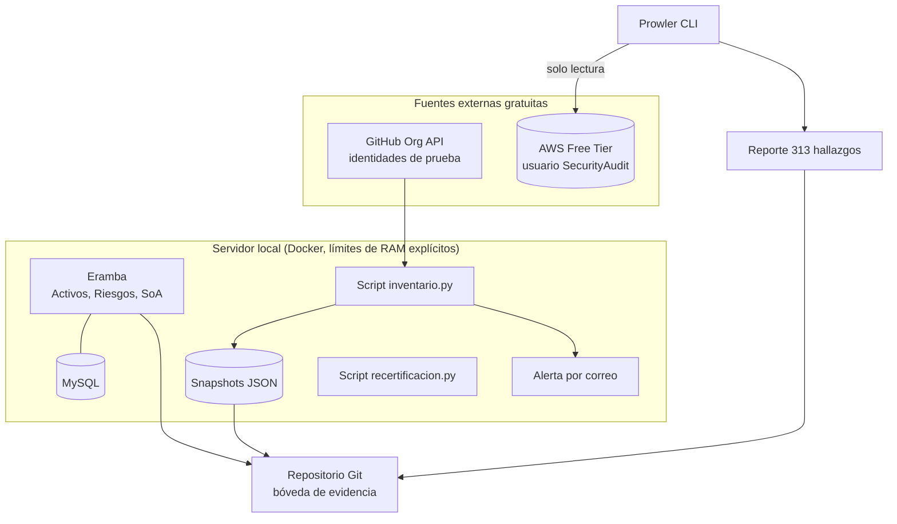
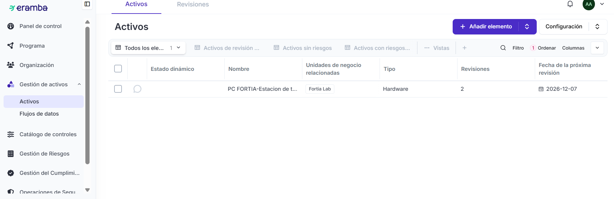
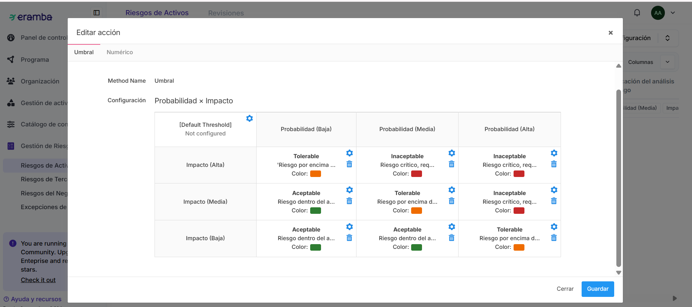
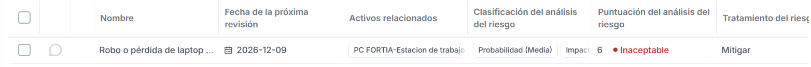
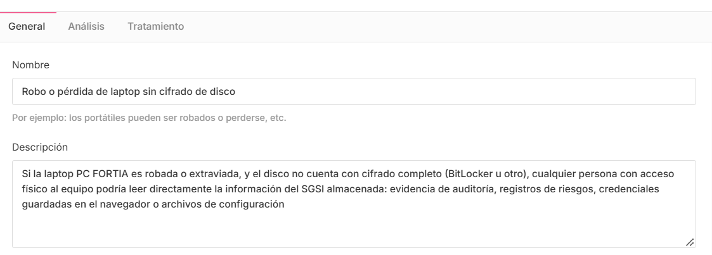
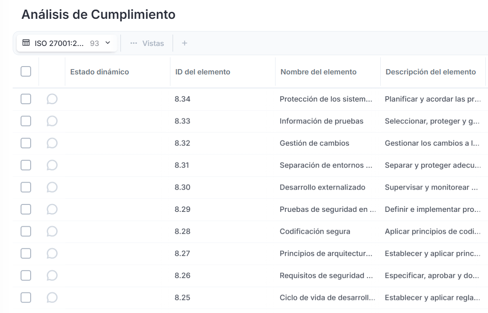
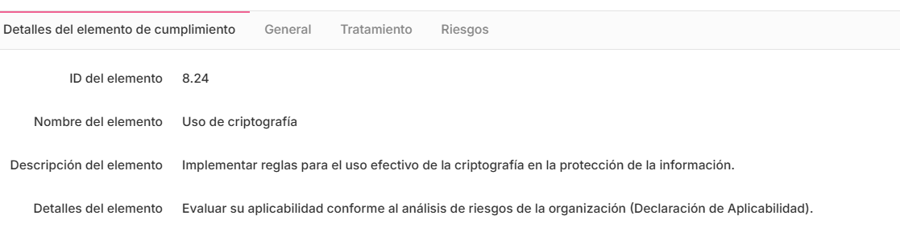
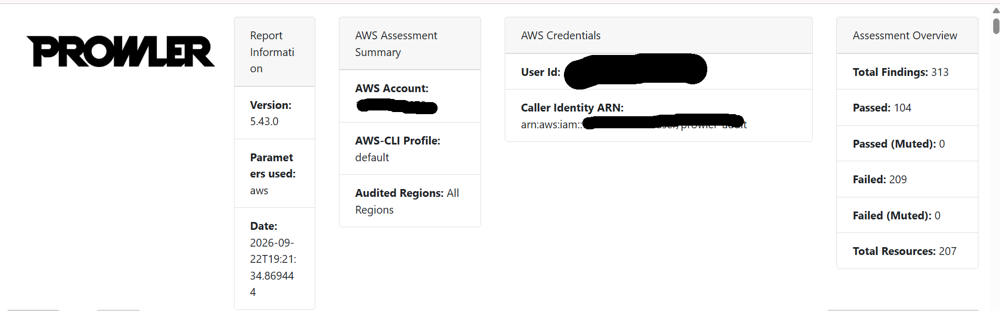
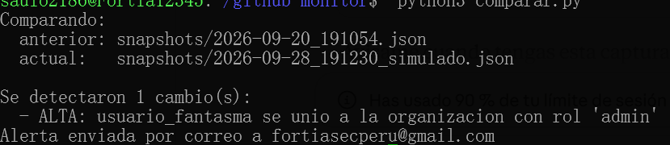
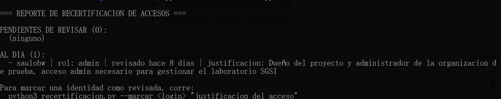

# Mini-SGSI: Sistema de Gestión de Seguridad de la Información (open source)

Proyecto personal construido de cero para implementar, en la práctica, los procesos centrales de un SGSI alineado a **ISO 27001:2022** — usando exclusivamente herramientas open source y un presupuesto de $0.

No es una maqueta ni un tutorial copiado: cada componente corre de verdad, contra datos reales (una organización de GitHub real, una cuenta de AWS real), y cada bug de por medio (varios) se diagnosticó y resolvió documentando el proceso.

## Qué resuelve este proyecto

| Requisito típico de un puesto de GRC / Seguridad Junior | Cómo se resuelve acá |
|---|---|
| Inventarios vivos de activos e identidades | Eramba (activos) + script Python contra la API de GitHub (identidades) |
| Monitoreo y alertas automatizadas sobre eventos críticos | Detección automática de altas/bajas/cambios de rol, con alerta por correo (SMTP) |
| Evidencia auditable, fechada y reproducible por un tercero | Repositorio Git como bóveda de evidencia: cada snapshot lleva hash SHA-256 y commit fechado |
| Recertificación de accesos: quién tiene acceso a qué, y por qué | Script de recertificación con justificación humana y umbral de 90 días |
| Registro de riesgos, controles y Declaración de Aplicabilidad | Eramba: metodología de riesgo propia (matriz 3x3), catálogo completo de 93 controles del Anexo A, SoA con trazabilidad Activo → Riesgo → Control |
| Auditoría de servicios en la nube | Prowler contra una cuenta AWS real, usuario IAM de solo lectura (`SecurityAudit`), 662 verificaciones, mapeadas a CIS/ISO 27001 |

## Arquitectura

## Componentes del repositorio

- **[github-identity-monitor](https://github.com/saulobw/github-identity-monitor)** — Inventario y monitoreo de identidades: detecta altas, bajas y cambios de permisos comparando snapshots fechados, con alerta automática por correo y recertificación de accesos con justificación.
- **[aws-cloud-audit](https://github.com/saulobw/aws-cloud-audit)** — Auditoría de una cuenta AWS real con Prowler (662 controles, mapeados a CIS/ISO 27001/SOC 2), usando un usuario IAM de solo lectura.
- **[iso27001-controles-catalogo.csv](./docs/iso27001_2022_anexo_a.csv)** — Catálogo completo de los 93 controles del Anexo A de ISO 27001:2022, en formato importable, generado y verificado contra la norma actual.
- **[capturas/](./capturas)** — Evidencia visual del SGSI funcionando: matriz de riesgo, Declaración de Aplicabilidad, panel de control.

*(Nota: la plataforma Eramba corre en un entorno local por diseño — es un sistema de gestión interno, no una aplicación pública. Las capturas a continuación muestran su funcionamiento real.)*

## Evidencia visual

**Inventario de activos** — cada activo con dueño, revisor y fecha de recertificación asignados:

**Matriz de apetito de riesgo** — metodología propia (Probabilidad × Impacto), con criterios objetivos documentados para cada nivel:

**Riesgo real identificado y tratado** — ejemplo completo: activo → amenaza → vulnerabilidad → análisis → tratamiento:

**Declaración de Aplicabilidad** — catálogo completo de 93 controles de ISO 27001:2022, con evaluación de aplicabilidad y trazabilidad hacia el riesgo:

**Auditoría de nube real con Prowler** — 313 hallazgos sobre una cuenta AWS real, usando un usuario IAM de solo lectura:

**Detección automática de eventos críticos de identidad** — alerta disparada y enviada por correo en tiempo real:

**Recertificación de accesos con justificación humana**:

## Stack técnico

Docker · WSL2 · Eramba (GRC/SGSI open source) · MySQL · Python 3 · API de GitHub · Prowler · AWS IAM · Git como control de integridad (SHA-256) · Brevo (SMTP transaccional)

## Decisiones de diseño que vale la pena señalar

- **Nunca se usaron credenciales de administrador para auditoría**: tanto el usuario de AWS (`SecurityAudit`, solo lectura) como el token de GitHub (permiso único: `Members: Read-only`) siguen el principio de menor privilegio.
- **Metodología de riesgo documentada, no improvisada**: la matriz de apetito de riesgo (Probabilidad × Impacto) tiene criterios objetivos escritos para cada nivel, no solo etiquetas.
- **Cada bug encontrado se documentó, no se ocultó** — incluyendo un caso de corrección masiva de esquema de base de datos (41 tablas) diagnosticado vía `information_schema`, y una migración forzada de versión de Python para resolver incompatibilidades de dependencias.

---

*Proyecto personal, en desarrollo activo. Contacto: [saulo2186@gmail.com]*
